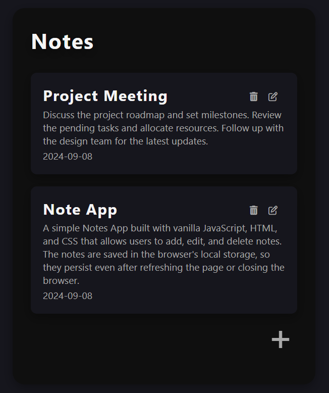

# Notes App

A simple Notes App built with vanilla JavaScript, HTML, and CSS that allows users to add, edit, and delete notes. The notes are saved in the browser's local storage, so they persist even after refreshing the page or closing the browser.

## Features

- **Add Notes**: Add a new note with a title, description, and optional date.
- **Edit Notes**: Edit existing notes by clicking the edit button.
- **Delete Notes**: Delete notes with a confirmation prompt.
- **Local Storage**: Notes are stored in the browser's local storage to persist between sessions.

